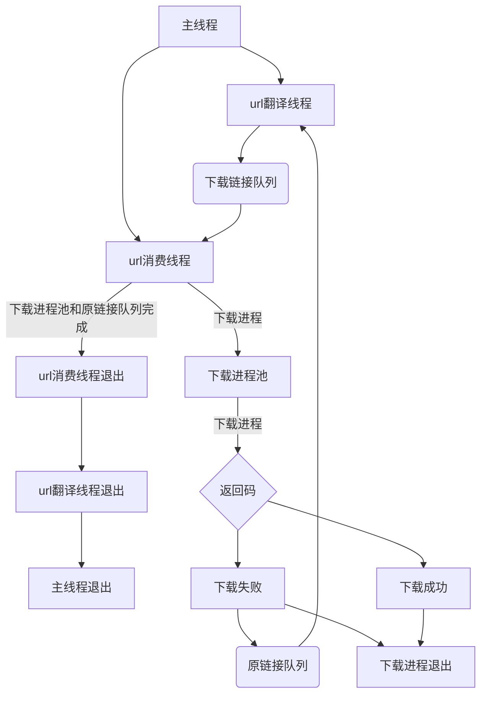

# P站下载器（无需翻墙）

> 小学渣的作品，不喜勿喷~

请在程序根目录下运行以下命令安装本程序的环境：

```
python -m pip install -r req.txt
```

## 如何使用？

在input.txt中加入你想下载的链接，运行根目录下的main.py



```mermaid
graph TD
main[主线程]
producer[url翻译线程]
consumer[url消费线程]
download_queue[下载进程池]
raw_url_queue(原链接队列)
download_url_queue(下载链接队列)
download_exit_code{返回码}
main_exit[主线程退出]
main-->producer
main-->consumer
raw_url_queue-->producer-->download_url_queue-->consumer-->|下载进程|download_queue
download_queue-->|下载进程|download_exit_code
download_exit_code-->download_failure[下载失败]
download_exit_code-->download_success[下载成功]
download_failure-->raw_url_queue
download_failure-->download_exit[下载进程退出]
download_success-->download_exit
consumer-->|下载进程池和原链接队列完成|cosumer_exit[url消费线程退出]-->producer_exit[url翻译线程退出]-->main_exit


```